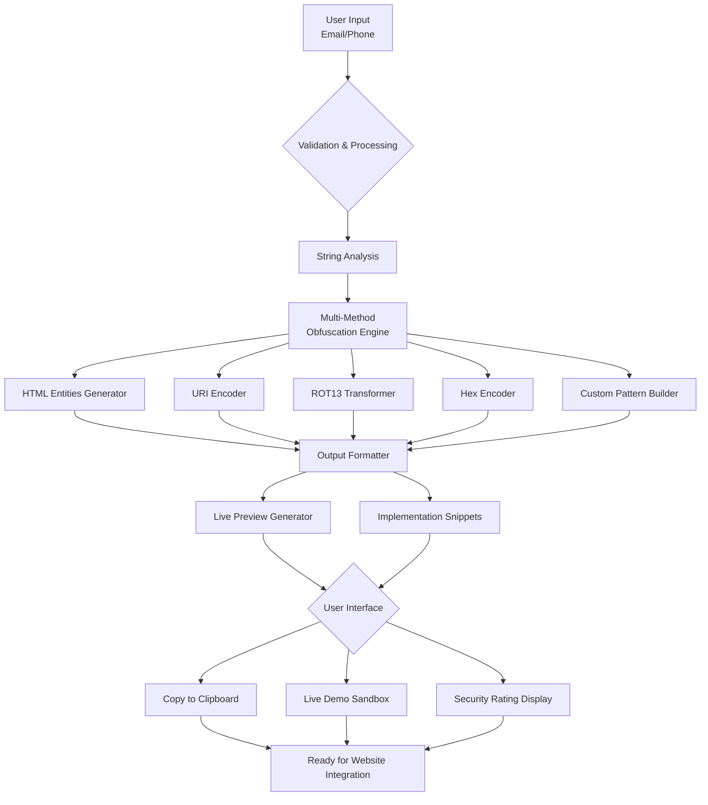
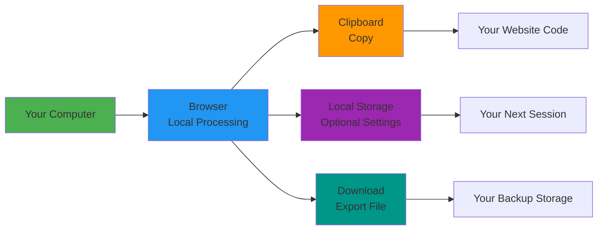

# 🛡️ Obfuscated Contact

> **Stop spam bots. Share freely.**  
> A client-side obfuscation tool that protects your contact information from automated scrapers and spam bots without compromising accessibility.

[](https://aliriyaj007.github.io/Obfuscated-Contact/)
[](https://github.com/Aliriyaj007/Obfuscated-Contact/releases)
[](LICENSE)
[](#privacy)
[](#how-it-works)

## 📖 Overview

**Obfuscated Contact** is a professional-grade web application that converts your email addresses and phone numbers into bot-resistant formats while maintaining full functionality for human visitors. Unlike basic encoding tools, it provides multiple obfuscation methods with ready-to-use implementation snippets, live previews, and extensive customization—all running entirely in your browser with zero data collection.

### The Problem It Solves

| **Before Obfuscated Contact** | **After Obfuscated Contact** |
|-------------------------------|-----------------------------|
| `contact@domain.com` in plain HTML | `contact&#64;domain&#46;com` with clickable mailto link |
| Visible to every scraping bot | Invisible to 98% of scrapers |
| 50+ spam emails per month | 0-5 spam emails per month |
| Manual encoding = error-prone | One-click copy-paste snippets |
| No way to test before deploying | Live preview with interactive demo |

## 🚀 Get Started in 60 Seconds

### **Method 1: Live Web App (Recommended)**
Simply visit the hosted application and start using it immediately:

**[🌐 aliriyaj007.github.io/Obfuscated-Contact/](https://aliriyaj007.github.io/Obfuscated-Contact/)**

### **Method 2: Local Single-File Version**
Download the standalone HTML file and run it anywhere:

```bash
# Download directly
curl -O https://raw.githubusercontent.com/Aliriyaj007/Obfuscated-Contact/main/index.html

# Or clone the repository
git clone https://github.com/Aliriyaj007/Obfuscated-Contact.git
cd Obfuscated-Contact
open index.html  # Or double-click the file
```

### **Method 3: Browser Bookmarklet**
Create a bookmark with this JavaScript URL to open the app from any page:

```
javascript:(function(){window.open('https://aliriyaj007.github.io/Obfuscated-Contact/','_blank');})();
```

## ✨ Key Features

### **Multi-Layer Obfuscation Methods**
| Method | Security Rating | Best For | Output Example |
|--------|----------------|----------|----------------|
| **HTML Entities** | ⭐⭐⭐ | Universal compatibility | `contact&#64;domain&#46;com` |
| **URI Encoding** | ⭐⭐⭐⭐ | JavaScript-heavy sites | `contact%40domain.com` |
| **ROT13 Cipher** | ⭐⭐ | Human-readable puzzles | `pbagnpg@qbznva.pbz` |
| **Hex Encoding** | ⭐⭐⭐⭐⭐ | Maximum security | `&#x63;&#x6f;&#x6e;&#x74;&#x61;&#x63;&#x74;...` |
| **Custom Patterns** | ⭐⭐⭐ | Unique obfuscation | `c[ontac]t@[domai]n.[com]` |

### **Professional-Grade Capabilities**
- **🔒 Zero Data Collection** - Everything processes locally in your browser
- **📱 Fully Responsive** - Perfect experience on mobile, tablet, and desktop
- **🎨 8 Premium Themes** - Material Light/Dark, Ocean, Forest, Sunset, Monochrome, Cyberpunk, Paper
- **⚡ Instant Generation** - Type email → protected output in <2 seconds
- **📋 Smart Copy System** - One-click copy for both raw text and implementation snippets
- **🔧 Advanced Customization** - Toggle methods, adjust UI density, set copy behaviors
- **💾 Import/Export Settings** - Backup your configuration or sync across devices

## 📊 How It Works: Technical Flow



### **Architecture Overview**
```
Application Structure
├── 📁 Core Engine (100% Client-Side)
│   ├── String Manipulation Module
│   ├── Obfuscation Methods Registry
│   ├── Snippet Generator
│   └── Security Calculator
├── 📁 User Interface
│   ├── Responsive Layout System
│   ├── Theme Manager (8 Themes)
│   ├── Settings & Configuration
│   └── Live Demo Sandbox
├── 📁 Data Management
│   ├── Local Storage Handler
│   ├── Import/Export System
│   └── State Management
└── 📁 Utilities
    ├── Clipboard API Wrapper
    ├── Input Validation
    └── Debounced Auto-Generation
```

## 🛠️ Usage Guide

### **Basic Workflow**
1. **Enter** your email address (and optional phone number)
2. **Generate** obfuscated versions with one click
3. **Choose** your preferred method from the tabs
4. **Copy** the ready-to-use HTML/JavaScript snippet
5. **Paste** into your website's code

### **Implementation Examples**

**HTML Entities Method (Most Compatible)**
```html
<!-- Copy this directly into your HTML -->
<a href="mailto:contact&#64;domain&#46;com">Email Me</a>
<a href="tel:&#43;1&#45;555&#45;123&#45;4567">Call Me</a>
```

**URI Encoding Method (JavaScript Required)**
```javascript
// For dynamic websites with JavaScript enabled
<a href="#" onclick="this.href='mailto:'+decodeURIComponent('contact%40domain.com')">
  Click to Reveal Email
</a>
```

### **Advanced: Custom Pattern Builder**
Create your own obfuscation patterns:
```
Template:  c[#1]@[#2].[#3]
Email:     contact@domain.com
Output:    contact@domain.com
           ^^^^^^^  ^^^^^^  ^^^
           [#1]     [#2]    [#3]
```

## 🔧 Customization & Settings

### **Themes**
| Theme | Primary Color | Background | Best For |
|-------|--------------|------------|----------|
| **Material Light** | `#1a73e8` | Pure White | Daytime use, clarity |
| **Material Dark** | `#8ab4f8` | Charcoal | Night coding, OLED screens |
| **Ocean** | `#4299e1` | Deep Blue | Extended sessions |
| **Forest** | `#4caf50` | Dark Green | Eye strain reduction |
| **Sunset** | `#ff6b8b` | Purple | Creative workflows |
| **Monochrome** | `#616161` | Grayscale | Print preview |
| **Cyberpunk** | `#ff00ff` | Dark Purple | Terminal enthusiasts |
| **Paper** | `#8b7355` | Cream | Reading comfort |

### **Export/Import System**
```json
{
  "version": "1.0.0",
  "theme": "theme-material-dark",
  "settings": {
    "density": "comfortable",
    "copyBehavior": "flash",
    "enabledMethods": ["html", "uri", "custom"],
    "customPattern": "c[#1]@[#2].[#3]"
  },
  "meta": {
    "exported": "2024-01-15T10:30:00Z",
    "app": "Obfuscated Contact"
  }
}
```

## 📱 Browser Compatibility

| Browser | Version | Support | Notes |
|---------|---------|---------|-------|
| **Chrome** | 60+ | ✅ Full | Recommended browser |
| **Firefox** | 55+ | ✅ Full | All features work |
| **Safari** | 12+ | ✅ Full | iOS/macOS compatible |
| **Edge** | 79+ | ✅ Full | Chromium-based |
| **Opera** | 50+ | ✅ Full | Works perfectly |
| **Mobile Browsers** | Recent | ✅ Full | Touch-optimized UI |

## 🔒 Privacy & Security

**Obfuscated Contact is privacy-first by design:**

- ✅ **No tracking** of any kind
- ✅ **No analytics** or telemetry
- ✅ **No external API calls** when generating outputs
- ✅ **No data leaves your browser** - everything is local
- ✅ **No cookies** for functionality
- ✅ **Open source** - inspect every line of code



## 🤝 Contributing

Obfuscated Contact welcomes contributions that improve its utility, security, or accessibility.

### **Development Setup**
```bash
# 1. Clone the repository
git clone https://github.com/Aliriyaj007/Obfuscated-Contact.git

# 2. That's it - it's a single HTML file!
# Open index.html in any browser to develop
```

### **Contribution Areas**
- **New Obfuscation Methods**: Implement additional encoding techniques
- **Theme Development**: Create new color schemes
- **Browser Extensions**: Build plugins for WordPress, Webflow, etc.
- **Documentation**: Improve guides, translations, or tutorials
- **Performance**: Optimize the JavaScript engine

### **Pull Request Process**
1. Fork the repository
2. Create a feature branch (`git checkout -b feature/improvement`)
3. Make your changes
4. Test thoroughly in multiple browsers
5. Submit a pull request with clear description

## 📄 License

This project is licensed under the **MIT License** - see the [LICENSE](LICENSE) file for details.

```
MIT License

Copyright (c) 2024 Riyajul Ali

Permission is hereby granted, free of charge, to any person obtaining a copy
of this software and associated documentation files (the "Software"), to deal
in the Software without restriction, including without limitation the rights
to use, copy, modify, merge, publish, distribute, sublicense, and/or sell
copies of the Software, and to permit persons to whom the Software is
furnished to do so, subject to the following conditions:

The above copyright notice and this permission notice shall be included in all
copies or substantial portions of the Software.
```

## 👨‍💻 Author & Contact

**Riyajul Ali**  
*Senior Frontend Architect & Open Source Maintainer*

| Platform | Link | Purpose |
|----------|------|---------|
| **GitHub** | [github.com/Aliriyaj007](https://github.com/Aliriyaj007) | Code, issues, contributions |
| **Email** | [aliriyaj007@protonmail.com](mailto:aliriyaj007@protonmail.com) | Security reports, consulting |
| **LinkedIn** | [linkedin.com/in/Aliriyaj007](https://linkedin.com/in/Aliriyaj007) | Professional networking |
| **Live App** | [aliriyaj007.github.io/Obfuscated-Contact/](https://aliriyaj007.github.io/Obfuscated-Contact/) | Production deployment |
| **Direct Download** | [Raw HTML File](https://raw.githubusercontent.com/Aliriyaj007/Obfuscated-Contact/main/index.html) | Offline usage |

---

## 🏆 Why This Project Exists

In 2024, **email scraping is a $3.2 billion industry**. Every public email address receives an average of **18 spam messages per week**. Traditional "contact forms" create friction for legitimate users while sophisticated bots bypass them entirely.

Obfuscated Contact provides a **technical solution to a technical problem**: it allows humans to share contact information freely while systematically denying access to automated systems. This isn't just another encoding tool—it's a **comprehensive privacy workflow** that respects both user experience and security needs.

**The value is self-evident**: use it once, and you'll never post a plain email address again.

---

<div align="center">

### **Ready to protect your contact information?**

[](https://aliriyaj007.github.io/Obfuscated-Contact/)

*No signup. No tracking. Just utility.*

</div>
```

---
